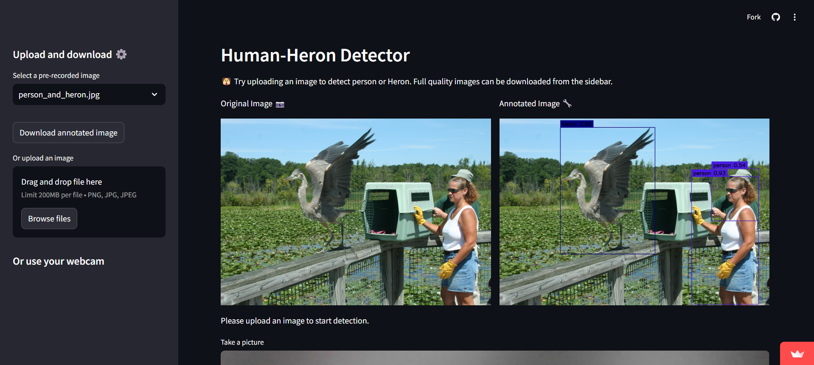

# 🦅 Human-Heron Detector


Welcome to the **Human-Heron Detector**! 

This project is a real-time Human-Heron detection application powered by **YOLOv8** and a **Streamlit** interface.

The streamlit app is accessible here [Humon-Heron Detector link](https://herondetectorapp-kxkhcaiot2ladzusdsnjvu.streamlit.app/).
 

## 📸 Features

- **Detect Humans and Herons**: Using YOLOv8 to identify humans and herons.
- **Webcam Integration**: Perform live detection using your device's webcam.

- **Image Upload and Pre-recorded Images**: Upload custom images or choose from a gallery of pre-recorded images.

- **Download Results**: Easily download the annotated images with bounding boxes.


## 📁 Project Structure

```bash
.
├──others
        ├── cam_inference_live.py       # Detection with Live camera
├──model
        ├── yolov8l.pt                  # Pytorch model of YOLOV8
├── pre_recorded_images                 # Pre-recorded images for selection in the app
        ├── ...
├── image_inference.py                  # YOLOv8 inference code for detection
├── streamlit_app.py                    # Main Streamlit application file
├── Dockerfile
├── requirements.txt                    # Python dependencies
└── README.md                           # Project documentation
```
## 🚀 Quick Start

Follow these instructions to get the project up and running on your local machine.

### 1. Clone the repository:

```bash
git clone https://github.com/ThomasBrdes/Heron_Detector_streamlit.git
cd human-heron-detector
```

### 2. Build the docker image:

```bash
docker build -t human-heron-detector .
```

### 3. Run the Docker container:

```bash
docker run -p 8501:8501 human-heron-detector
```

### 4. Access the app:

Once the container is running, open your browser and navigate to http://localhost:8501 to access the Streamlit app.


## 📸 Screenshots

Main Interface:



## 💻 Tech Stack

- **Python**: Programming language
- **YOLOv8**: Deep learning model for real-time object detection
- **Streamlit**: Web framework for building interactive web applications


## 📚 Acknowledgements

> 🔍 **Code inspired by**: [SkalskiP/yolov8-live](https://github.com/SkalskiP/yolov8-live/tree/master)  
> 🎨 **Streamlit UI inspired by**: [tyler-simons/BackgroundRemoval](https://github.com/tyler-simons/BackgroundRemoval/tree/main)
